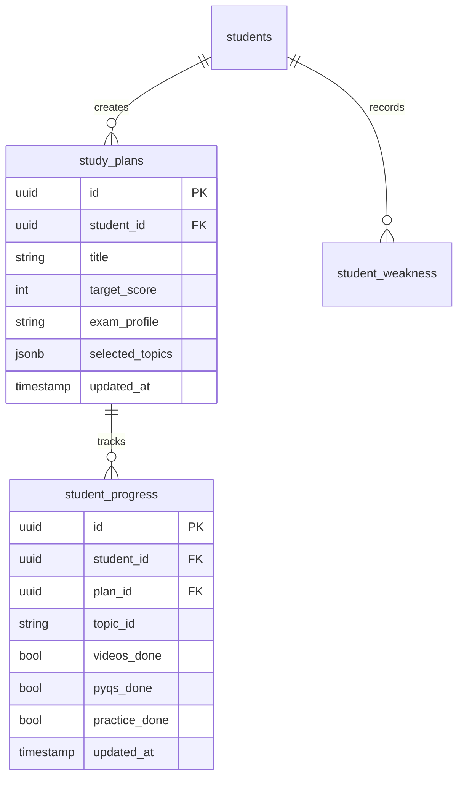

# Project Report

## GoalSlider AI
### Smart Exam & Campus Placement Preparation Planner

---

**Project Type:** Full-Stack AI-Powered EdTech Web Application
**Technology Stack:** Next.js 14, React 18, TypeScript, Tailwind CSS, Supabase (PostgreSQL)
**GitHub Repository:** https://github.com/PraveenB45/ai-powered-goal-slider

---

## 1. Executive Summary

**GoalSlider AI** is a modern, AI-powered study planning and progress tracking web application designed to help students prepare smarter — not harder — for competitive government exams (SSC, Banking, Railways) and corporate campus placement drives.

The core philosophy of GoalSlider AI is rooted in a simple but powerful insight:

> *"If a 100-mark paper requires 60 marks to pass, why study 100% of the syllabus? Study the smartest 60%."*

The application implements a **dynamic Goal Slider** that allows students to set their target score (e.g., 65%). A weighted AI scoring engine then calculates and recommends the minimum set of high-yield topics needed to achieve exactly that target — eliminating unnecessary study time and reducing exam anxiety.

The platform is production-ready, fully responsive, and built with a premium glassmorphic UI design that provides an engaging and motivated study experience.

---

## 2. Problem Statement

Students preparing for competitive exams face three core problems:

| Problem | Description |
|---|---|
| **Syllabus Overload** | Modern competitive exams span 20-30+ topics. Studying all of them exhaustively is impractical under real time constraints. |
| **Lack of Personalization** | Generic study guides provide the same plan to every student, ignoring individual weaknesses, time availability, and exam-specific patterns. |
| **Fragmented Tracking** | Students preparing for multiple exams simultaneously have no centralized dashboard to track progress, streaks, and achievements per plan. |

---

## 3. Proposed Solution

GoalSlider AI solves these problems with three interconnected layers:

### Layer 1: AI Recommendation Engine
A multi-criteria optimization algorithm that ranks topics by:
- **PYQ Frequency** — How often has this topic appeared in past year papers?
- **Marks Weightage** — What percentage of the exam does this topic contribute?
- **Difficulty** (inverted) — Easy topics that score marks are selected first.
- **Student Weakness** — Topics where the student historically struggles are prioritized.

$$\text{Topic Score} = (F_{PYQ} \times 0.40) + (M_{weight} \times 0.30) + ((10 - D) \times 0.10) + (S_{weak} \times 0.20)$$

A **Greedy Selection Algorithm** picks topics in ranked order until cumulative marks coverage meets or exceeds the student's target score.

### Layer 2: User Authentication & Multi-Plan Persistence
A fully secure authentication system (via Supabase Auth) that allows users to:
- Create accounts, log in, and reset passwords.
- Save multiple custom roadmaps under unique study plan records.
- Resume any saved plan — with all slider settings, topic overrides, and progress restored.

### Layer 3: AI Study Dashboard (Central Hub)
A feature-rich dashboard that acts as the central cockpit for monitoring exam readiness, including:
- Overall completion percentage with a circular progress ring.
- Daily study streak tracker.
- Today's dynamic task schedule.
- AI-generated contextual suggestions.
- Spaced repetition revision schedule.
- Weekly activity chart.

---

## 4. System Architecture

```
┌────────────────────────────────────┐
│           Browser (Client)          │
│                                    │
│  ┌──────────┐   ┌───────────────┐  │
│  │ Next.js  │   │  Framer       │  │
│  │ App      │◄──│  Motion +     │  │
│  │ Router   │   │  Tailwind CSS │  │
│  └──────────┘   └───────────────┘  │
│        │                           │
│  ┌────────────────────────────┐    │
│  │  React State (useMemo,     │    │
│  │  useCallback, useEffect)   │    │
│  └──────────────┬─────────────┘    │
└─────────────────┼──────────────────┘
                  │ Supabase JS Client
┌─────────────────▼──────────────────┐
│          Supabase Backend           │
│                                    │
│  ┌──────────┐  ┌─────────────────┐ │
│  │ Auth     │  │ PostgreSQL DB   │ │
│  │ (JWT)    │  │ (Row Level      │ │
│  └──────────┘  │  Security)      │ │
│                └─────────────────┘ │
└────────────────────────────────────┘
```

---

## 5. Database Schema

### 5.1 Tables Overview

| Table | Purpose |
|---|---|
| `students` | User profiles linked to Supabase Auth UUID |
| `study_plans` | Saved AI roadmaps per user with target score, exam profile, and topic overrides |
| `student_progress` | Per-task completion status (Videos, PYQs, Practice) tied to a specific `plan_id` |
| `student_weakness` | Per-topic weakness scores for personalizing the AI ranking |

### 5.2 Entity Relationship



### 5.3 Data Isolation via Row Level Security (RLS)

All tables enforce RLS policies ensuring:
- Students can **only read, write, and delete their own records**.
- Cross-user data leaks are impossible at the database level.

---

## 6. Application Features

### 6.1 User Authentication System

| Feature | Implementation |
|---|---|
| Sign Up | Supabase `auth.signUp()` — creates user record |
| Login | Supabase `auth.signInWithPassword()` |
| Remember Me | Session persistence toggle |
| Forgot Password | Supabase `auth.resetPasswordForEmail()` — secure email link |
| Protected Routes | Server-side session check redirects unauthenticated users to `/auth` |
| Logout | `auth.signOut()` — clears JWT and redirects |

### 6.2 Goal Slider & AI Optimizer

- **Dynamic Slider (0–100%):** Instantly recalculates topic selection on every change.
- **Exam Profiles:** Switches the recommendation algorithm between:
  - **Govt Exams (SSC/Bank):** Prioritizes Quant, Reasoning, GK, English.
  - **Campus Placements:** Prioritizes DSA, DBMS, Technical Core.
- **Calibrator Controls:** Adjustable weight coefficients for PYQ, Weightage, Difficulty, and Weakness.
- **Manual Fine-Tuning:** Force-include or force-exclude any topic from the AI plan.
- **Dual Area Chart:** Recharts visualization showing cumulative syllabus coverage vs. marks gain.

### 6.3 AI Study Dashboard (`/dashboard`)

| Section | Description |
|---|---|
| 🎯 Target Score Card | Shows active plan's goal %, exam type, and days remaining |
| 📈 Progress Ring | Circular SVG animating current completion percentage |
| 📅 Today's Plan | 2-topic dynamic daily schedule with inline task checkboxes |
| 🤖 AI Suggestions | Context-driven feed of personalized preparation tips |
| 📊 Weekly Chart | Recharts bar graph of daily completions for the current week |
| 🔥 Streak Tracker | Consecutive daily study streak counter |
| ⭐ Readiness Score | Aggregate of completion % × target score |
| 📚 Next Module | Highest-priority uncompleted topic highlighted |
| 📅 Revision Schedule | Spaced repetition dates for completed topics (3/7/14 days) |
| ✅ Recent Completions | Timeline of recently finished modules |
| 📋 Curriculum Checklist | Complete topic list with 🎥 Videos / 📝 PYQs / 🏆 Practice toggles |

### 6.4 My Study Plans (`/plans`)

- Grid view of all saved plans with live progress bars per plan.
- **Search** by plan title.
- **Sort** by Newest, Oldest, Highest Target Score.
- **Continue** any plan — restores full slider state via URL query parameter (`?planId=xxx`).
- **Delete** a plan along with all associated progress records.

---

## 7. Technical Stack Details

| Layer | Technology | Version | Purpose |
|---|---|---|---|
| Framework | Next.js | 14.2.5 | App Router, SSR, File-based routing |
| UI Library | React | 18 | Component architecture, hooks |
| Language | TypeScript | 5.x | Type safety across all components |
| Styling | Tailwind CSS | 3.x | Utility-first responsive styling |
| Animations | Framer Motion | 11.x | Page transitions, micro-animations |
| Charts | Recharts | 2.x | Area charts, bar charts |
| Backend | Supabase | 2.x | Auth, PostgreSQL, RLS |
| Package Manager | npm | 10.x | Dependency management |

---

## 8. Performance & Build Metrics

From latest production build (`npm run build`):

| Route | Bundle Size | First Load JS |
|---|---|---|
| `/` (Goal Slider) | 18.8 kB | 309 kB |
| `/dashboard` | 6.65 kB | 260 kB |
| `/plans` | 3.04 kB | 159 kB |
| `/auth` | 2.38 kB | 189 kB |

- ✅ **Zero TypeScript errors** across all routes.
- ✅ **All 7 pages compiled successfully** on production build.
- ✅ **Responsive** — tested on desktop, tablet, and mobile viewports.

---

## 9. Security Considerations

| Area | Measure |
|---|---|
| Authentication | Supabase JWT tokens — no plaintext password storage |
| Database Access | Row Level Security (RLS) enforced on all tables |
| Protected Routes | Unauthenticated users are hard-redirected to `/auth` |
| Data Isolation | Progress tracking uses `plan_id` FK — no cross-plan data mixing |
| Env Variables | Supabase URL and anon key stored in `.env.local`, excluded from Git |

---

## 10. Future Enhancements

| Feature | Description |
|---|---|
| 🤖 AI Doubt Solver | Floating chat assistant powered by an LLM API for real-time topic Q&A |
| 📝 Mock Test Engine | Auto-generated quizzes based on the active plan's selected topics |
| 🏆 Leaderboards | Global XP-based ranking to gamify exam preparation |
| 📱 PWA Support | Offline access and mobile home screen installation |
| 📊 Advanced Analytics | GitHub-style contribution heatmap for study activity |

---

## 11. Conclusion

GoalSlider AI successfully transforms the way students approach competitive exam preparation by replacing exhaustive, generic study plans with a mathematically optimized, personalized AI roadmap. The application's production-ready architecture, secure database design, and feature-rich interactive dashboard make it a compelling, real-world EdTech platform.

By focusing on **target score optimization** rather than full syllabus completion, GoalSlider AI helps students achieve their goals faster, with less effort, and with complete visibility into their exam readiness at every step.

---

*Report generated for GoalSlider AI v2.0 — July 2026*
