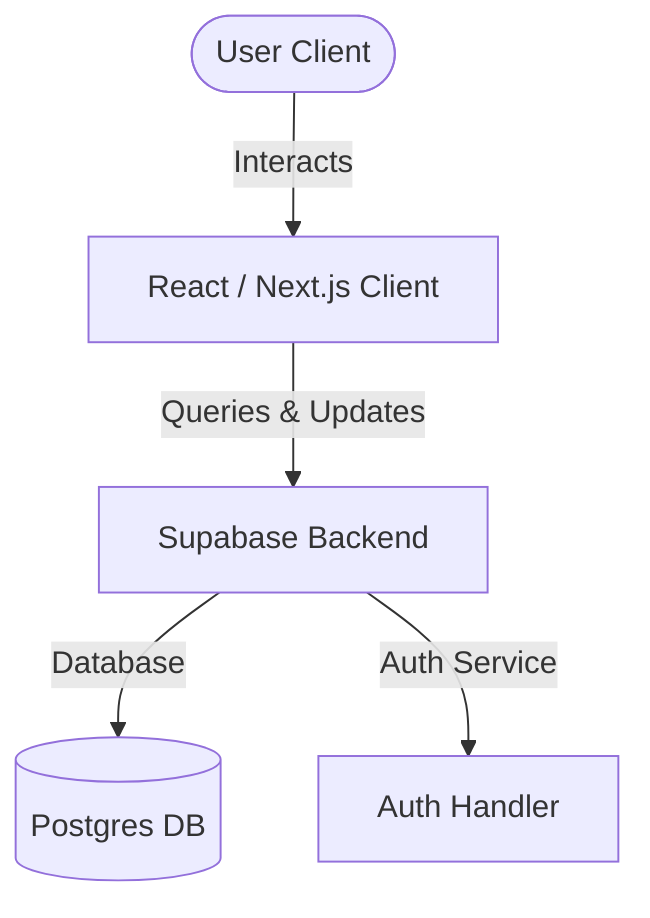
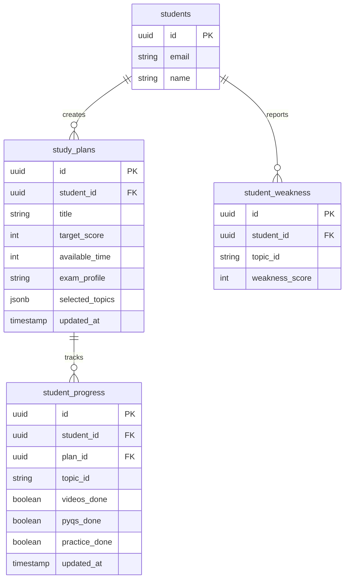

# Project Report: GoalSlider AI
**Smart Exam & Campus Placement Preparation Planner**

---

## 1. Executive Summary
**GoalSlider AI** is a modern, responsive, and web-based study planning dashboard designed to optimize exam preparation for students. Traditional preparation strategies require covering 100% of a massive syllabus, which is highly inefficient for passing exams where the cutoff is lower (e.g., 60%). 

GoalSlider AI introduces an **AI-powered recommendation engine** that determines the most high-yield topics based on historical weights, exam profile (Government vs. Campus Placement), difficulty, and personal weaknesses. By allowing the user to select their target score using a dynamic **Goal Slider**, the application computes the minimum required topics, saving study time and avoiding burnout.

---

## 2. Problem Statement
1. **Syllabus Overload:** Competitive exams (such as SSC, Banking) and placement drives feature vast syllabi. Students spend equal effort on low-yield topics, reducing overall efficiency.
2. **Lack of Personalization:** Existing study plans are static. They do not adapt to individual weaknesses, available preparation time, or changing target scores.
3. **Tracking Fragmentation:** Managing study progress, streaks, and achievements across multiple different exams causes friction and loss of consistency.

---

## 3. System Architecture & Design
GoalSlider AI is built as a Single Page Application (SPA) using a modern, decoupled architecture:

### 3.1 Tech Stack
- **Frontend Framework:** Next.js (React.js) using App Router, TypeScript.
- **Styling & UX:** Tailwind CSS (for glassmorphism and responsiveness), Framer Motion (for transitions and micro-animations).
- **Data Visualization:** Recharts (for progress trends and cumulative syllabus-to-marks mapping).
- **Backend-as-a-Service:** Supabase (Auth, PostgreSQL DB, and Row Level Security).

---

## 4. Database Schema Design
The database structure is designed to isolate user data and enable multiple saved plans with independent progress trackers.

---

## 5. Core Features & Implementation

### 5.1 Dynamic Goal Slider & AI Optimizer
- **Mechanism:** As the slider moves, it adjusts the `target_score` (%).
- **AI Ranking Formula:** Topics are sorted dynamically using a weighted score:
  $$\text{AI Score} = (\text{PYQ Freq} \times W_{pyq}) + (\text{Weightage} \times W_{weight}) + ((10 - \text{Difficulty}) \times W_{diff}) + (\text{Weakness} \times W_{weak})$$
- **Optimization:** The system runs a greedy selection algorithm starting from the highest-ranked topic until the target score of cumulative marks is reached, identifying the minimal set of topics required.

### 5.2 User Authentication & Protected Routes
- **JWT & Supabase Auth:** Seamless login, signup, password resets, and logout.
- **Protected Paths:** Routes like `/dashboard` and `/plans` automatically redirect unauthenticated users back to `/auth`.

### 5.3 Learning Progress Dashboard
- Displays overall progress percentages, topics completed vs. remaining, and estimated study hours left.
- **Activity Chart:** Uses `Recharts` to draw a weekly overview of completed subtasks.
- **Streaks & Badges:** Features a gamified dashboard displaying current study streaks and milestone badges (e.g., "🌱 First Step", "🥉 25% Done", "🏆 Master").

### 5.4 Saved Plans Management (`/plans`)
- Allows users to save multiple custom configurations.
- Restores the exact state of the slider, exam profile, and selected topics upon resuming.
- Offers search, sorting, and full deletion capabilities.

---

## 6. Verification and Performance
- **TypeScript Safety:** The project is compiled and statically verified without type errors.
- **Responsive Layout:** Responsive container styling ensures usability on desktop screens, tablets, and mobile devices.
- **Security:** Supabase Row Level Security (RLS) policies restrict database operations, ensuring students can only view or modify their own plans and progress records.

---

## 7. Future Enhancements
1. **Interactive AI Doubt-Solver:** Integrate LLM APIs to provide context-aware chat assistance on specific topics.
2. **Dynamic Mock Test Generation:** Auto-create mock tests using the topic checklist.
3. **Collaborative Study Rooms:** Gamify preparation by enabling peer-to-peer leaderboards.

---

## 8. Conclusion
GoalSlider AI successfully implements a smart, data-driven approach to exam preparation. By shifting the focus from "syllabus completion" to "target score optimization", the application significantly reduces preparation time, provides structured tracking, and offers a highly responsive and visually engaging user interface.
